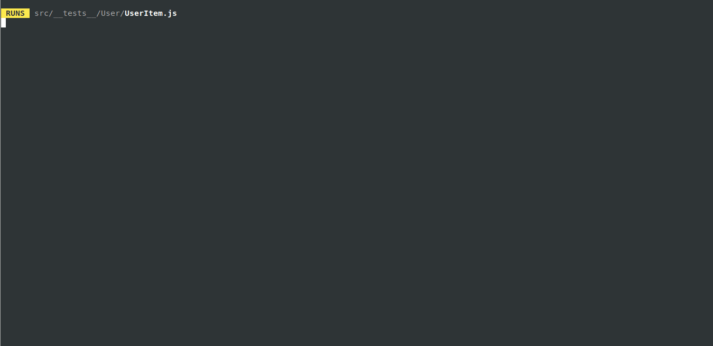
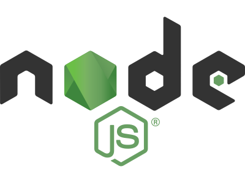

# Frontend Test Code Project for DSPOT [](https://dspot-test.netlify.app) [](https://GitHub.com/DiegoAWS/frontend-test)

## Structure

- [Deployed Project](#deployed-project)
- [Runing the project locally](#runing-the-project-locally)
- [Testing](#testing)

You can see the live project at [this firebase hosting.](https://dspot-test.netlify.app)

Test running proccess, to reproduce test locally follow instructions [here](#testing)

[](#testing)

[](#readme)

## Deployed Project

To see this project you could visit https://dspot-test.netlify.app or you could clone it and run it locally.
<br> <br><br>

[](#readme)

## Runing the project locally




Before start make sure you have installed this tools:

- [Node JS](https://nodejs.org/en/) – LTS version or newer.
- [NPM](https://www.npmjs.com/) – Usually comes with Node.
- [Git](https://git-scm.com/) – Git CLI.

To make sure you have this tool installed please open a terminal and type:

```sh
node --version
```

```sh
npm --version
```

and

```sh
git --version
```

expecting something similar to (o newer versions):

```sh
node --version
v14.17.0

npm --version
6.14.13

git version
git version 2.20.1
```

Once you have installed `node` `npm` and `git` you can download/install this project:

```sh
git clone https://github.com/DiegoAWS/frontend-test.git
cd frontend-test
npm install
npm start
```

You will see the project in a browser at http://localhost:3000/

[](#readme)

## Testing

Test are availables with [Jest testing Framework](https://jestjs.io/). After running [commands above](#runing-the-project-locally), please run in the project directory:

```sh
npm test
```
